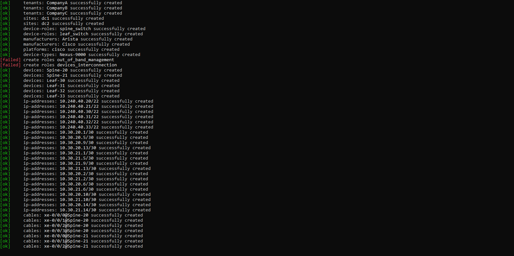

# About
Script which build automatically all elements in Netbox using API request and Python language<br>
Tested with:<br>
- Netbox v2.9.2
- Python 3.8.2 

# HowTo
- check diagram folder for topology example
- check 'config/variables.yaml' file to set what you need

# Run
- edit variables (you can add additional parameters from API syntax)
- run:<br>

```console
bash# python3 configure_netbox.py -h
usage: configure_netbox.py [-h] [-c CONFIG]

optional arguments:
  -h, --help            show this help message and exit
  -c CONFIG, --config CONFIG
                        YAML File with configuration (default='config/variables.yaml')
```




'Failed' is only as exemple how script react on existing elements in Netbox


# Config-Device-Types
Use predefined device types from official repo: netbox-community/devicetype-library
'''bash
yum install -y unzip
cd /opt/python_netbox_create_dc/config/devicetypes
wget https://github.com/netbox-community/devicetype-library/archive/master.zip -O /tmp/master.zip
unzip  /tmp/master.zip -d /tmp/
cp -R /tmp/devicetype-library-master/device-types/* /opt/python_netbox_create_dc/config/devicetypes
'''
